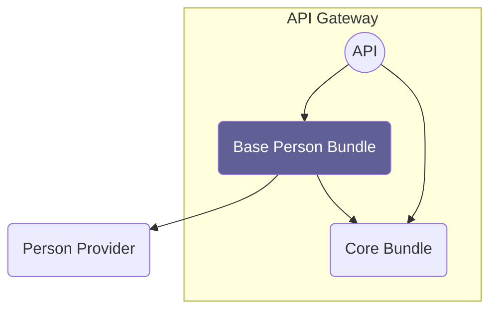

# Overview

Source: https://github.com/digital-blueprint/relay-base-person-bundle

### Person Provider

An interface that needs to be implemented and provides the information for all
API users. Can be implemented using LDAP, Keycloak, CAMPUSOnline, etc. or a
combination of multiple backends.
